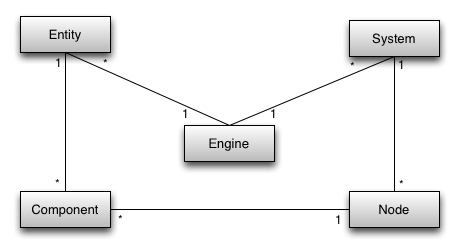

# 2 months later

## Week 1

I ported the project to nuxt.js

## Week 2

I rewrote the frontend in vue

## Week 3

I am rewriting the scene class as the way it works is completely broken, and extremely buggy.

I decided to use [Richard Lord's](https://www.richardlord.net/blog/ecs/what-is-an-entity-framework)  blog on entity
framework system to build my own engine.
ChatGPT was no longer able to anser my questions. I needed a strong source material where
i can understand how people really did it in the past.

First I simplified everything into indivisual components.

1. System interface -> managed by SystemManager
   

## Week 4

Finally a barely working ECS is ready now. I can now spawn a horizontal and vertical array. Its hard to think in the way
ECS works, but once you do, the code become so much simpler and decoupled.
Animating in ECS is also extremely easy.

Now i will start working on the array swap and some animation followed by parsing my AST of code into commands that can
control the scene.
